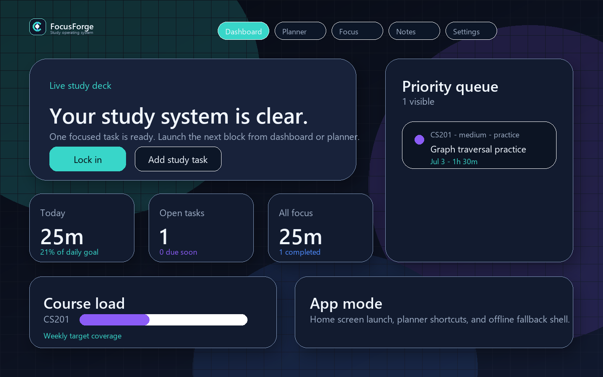
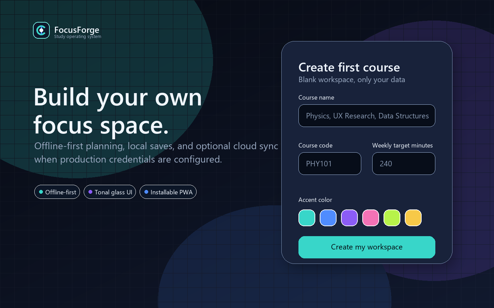
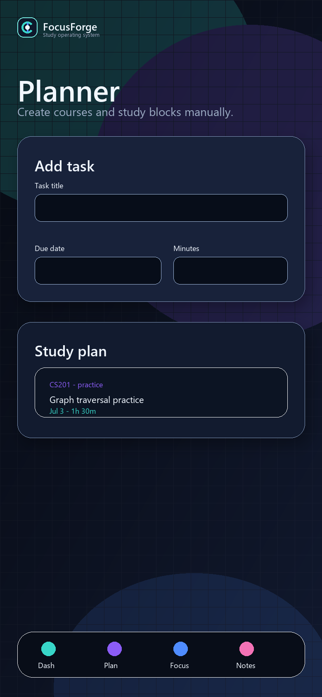

# FocusForge

FocusForge is a production-oriented PWA study management app for students. It combines a responsive dashboard, first-run onboarding, study planner, focus sessions, notes, offline support, Clerk-ready authentication, and Supabase-ready persistence.



## Why FocusForge

FocusForge is built for students who want a clean operating system for studying without fighting clutter. The app starts as a blank workspace, asks the user to create their own first course, then lets them manually plan study tasks, capture notes, and complete focus sessions.

## Preview

Preview content is illustrative. The shipped app starts blank and does not seed demo courses, tasks, notes, or sessions.

| First-run onboarding | Mobile planner |
| --- | --- |
|  |  |

## Core Use Cases

- Plan course work manually with course-specific tasks, due dates, priorities, and time estimates.
- Run focused study blocks tied to real tasks and log session quality.
- Capture lightweight course notes with local-first persistence.
- Use the app offline through a cached PWA shell and visible offline state.
- Install FocusForge to a phone or desktop for an app-like study workflow.

## Product Highlights

- Blank first-run onboarding with visible validation and no prefilled values.
- Material You-inspired glassmorphism UI with high-contrast surfaces.
- Responsive navigation and dashboard layouts for mobile, tablet, and desktop.
- Safe storage wrapper that falls back when browser storage is blocked.
- Browser-gated install prompt, manifest shortcuts, app icons, and service worker.
- Clerk-ready authentication and Supabase-ready event sync architecture.

## Stack

- Next.js App Router
- TypeScript
- Tailwind CSS 4
- Clerk for authentication
- Supabase for cloud data persistence
- Local-first safe storage fallback
- Custom service worker and web manifest

## Folder Structure

```text
src/app                 App Router pages, metadata, API routes
src/components/app      Product UI and dashboard modules
src/components/auth     Clerk-aware auth UI with guest fallback
src/components/brand    Logo and brand primitives
src/components/pwa      Service worker and install helpers
src/hooks               Network, PWA, and study store hooks
src/lib                 Validation, storage, Supabase, logging, types
public/brand            SVG logo exports
public/icons            PWA icon assets
supabase/schema.sql     Production schema, indexes, and RLS policies
```

## Setup

```bash
npm install
npm run dev
```

Open `http://localhost:3000`.

The app runs without external credentials in guest mode. To enable production auth and sync, copy `.env.example` to `.env.local` and add Clerk and Supabase values.

FocusForge starts with a blank workspace. Users create their own first course during onboarding, then add tasks, notes, and focus sessions manually. No demo courses, tasks, notes, or sessions are seeded into the app.

## Validation

```bash
npm run lint
npm run typecheck
npm run build
npm run audit
```

## Production Notes

- Apply `supabase/schema.sql` before enabling sync.
- Configure Clerk JWT integration for Supabase RLS policies.
- Keep service role keys server-only. The frontend uses only the public anon key.
- The app avoids direct `localStorage` dependency through a safe storage wrapper with memory fallback.
- The service worker caches the app shell, brand assets, icons, and offline route.
- The PWA install prompt is browser-gated: FocusForge displays the install modal automatically only after the browser emits `beforeinstallprompt`.
- Chrome/Edge generate the installed app splash screen from the manifest name, icon set, theme color, and background color.

## QA Checklist

- Responsive dashboard works on mobile, tablet, and desktop.
- Theme switch does not reduce contrast.
- First-run onboarding uses blank inputs and visible app-level validation.
- Add task form validates required fields and date values.
- Focus session can start, pause, reset, and complete.
- Offline banner appears when the browser reports offline.
- Offline route renders at `/offline`.
- Manifest and service worker are reachable.
- Build, lint, and typecheck pass before deployment.
